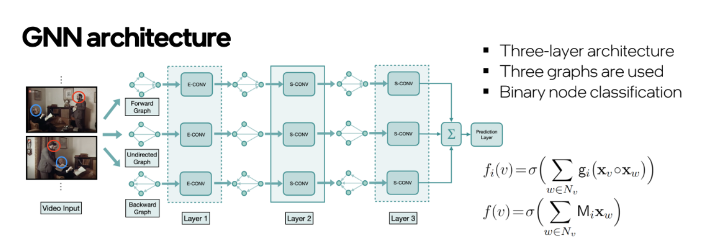
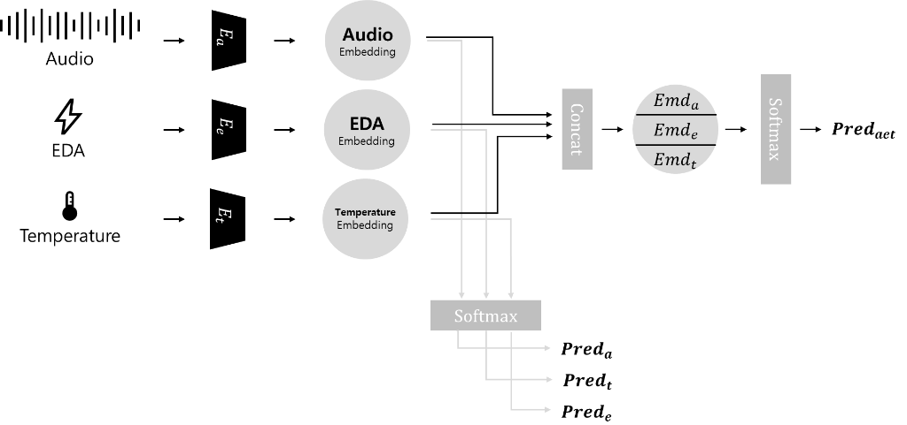
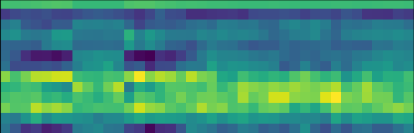

# (2023) 제 2회 휴먼이해 인공지능 논문경진대회
> 본 대회는 한국전자통신연구원(ETRI)이 주최하고 과학기술정보통신부와 국가과학기술연구회(NST)가 후원합니다
---
## Multi-model Emotion Recognition Model based on Temporal Graph Learning
## Abstract
> 최근 딥러닝 기술이 발전하면서, 인간-컴퓨터 상호작용(HCI) 분야의 연구가 활발히 진행되고 있다. 감정 인식 분야는 HI 연구 분야의 주요 과제 중 하나이다. 감정 인식을 통해 사용자는 더욱 현실감 있는 사용자 경험을 얻을 수 있다. 뛰어난 사용자 경험을 제공하기 위해서는 높은 정확도가 요구된다. 최근 딥러닝에서는 '멀티 모달' 기술을 통하여, 여러 모달리티에 있는 데이터를 융합하여 높은 정확도를 얻고자 하는 시도를 하였다. 이에 본 연구에서는, 인코더를 통한 좋은 잠재 공간을 구하고, 이를 GNN 모델 기반 네트워크를 통하여 감정 인식 작업을 진행했다. 이 작업을 진행하기 위하여 발화 상황의 오디오 데이터, EDA 데이터 그리고 온도 데이터를 융합하여 사용했다. 멀티 모달 데이터를 사용하여, 다양한 단서를 모델의 학습에 이용할 수 있게되었다.

## 1. 소개
### 1.1 대회 소개
#### 멀티모달 감정 데이터셋 활용 감정 인식 기술 분야
- 인간과 교감할 수 있는 인공지능 구현을 위해서는 인간의 행동과 감정을 이해하는 기술이 필요합니다.
- 사람의 행동과 감정을 이해하는 기술 연구를 가능토록 하기 위해 구축한 데이터셋을 활용하여 휴먼이해 인공지능 기술 연구를 확산시키고 창의적인 여구를 발굴하고자 ETRI에서 대회를 개최했습니다.

- Task는 다음과 같습니다.
    - 우리는 본 연구에서 일반인 대상 자유발화:[KEMDy20](https://nanum.etri.re.kr/share/kjnoh/KEMDy20?lang=ko_KR) 데이터셋을 활용하여 감정의 레이블(기쁨, 놀람, 분노, 중립, 혐오, 공포, 슬픔)에 대한 분류 정확도(F1)를 제시합니다.
    - 멀티모달 데이터를 혼합합니다. 발화음성과 EDA 데이터, 온도 데이터를 사용하여 멀티모달 데이터 감정인식 모델을 구축했습니다.
    - 임베딩 벡터로 graph를 생성하여 GNN 모델에 통과시켜 감정분류 예측을 합니다.


### 1.2 Methodolgy

#### Model Architecture

참조한 [GNN model architecture](https://github.com/SRA2/SPELL) 입니다. 연결을 할 때 관계 정보를 충분히 부여하기 위해 forward, backward, undirect conntection을 추가하고 3개의 Layer를 통과 후 합친 후 softmax를 통해 7개의 감정 확률분포를 생성합니다.

#### Data Embedding

음성, EDA, 온도 데이터를 각각의 인코더를 통해 모달 별 임베딩 벡터를 구하고 다층 신경망을 통하여 각각의 예측값을 구합니다. 또한, 이렇게 얻어진 임베딩 벡터를 하나의 벡터로 합하고, 다층 신경망을 통과하여 새로운 예측값을 구합니다. 이렇게 얻어진 예측값 네 개를 모두 합하여, 손실값을 구합니다.
###


### 1.3 코드 설명

```data_loader.py``` : data loading for generating graph and training, validation

```generate_graph.py``` : 임베딩 벡터로 graph 생성

```models_gnn.py``` : 우리의 모델

```train_val.py``` : 학습과 검증을 진행

### 1.4 데이터 전처리
- 우리가 수행한 데이터 전처리 과정을 제시합니다.
- KEMDy 데이터셋에서 감정 레이블이 있는 시간의 데이터만 가져옵니다. 이후, 감정을 예측하려는 특정 시점이 정해지면 특정 시점에서부터 사용자가 설정한 길이만큼을 앞 뒤에서 자릅니다. 이후 각 시간에 맞는 오디오 데이터, EDA 데이터, 온도 데이터를 가져옵니다.
#### 음성 데이터

</br>
음성 데이터의 경우 mel-spectrogram의 이미지로 가져와서 2D 기반의 ResNet18 인코더를 사용하여 임베딩 벡터를 구합니다.
#### EDA, 온도 데이터
EDA와 온도 데이터는 1D 기반의 ResNet18 인코더를 사용하여 임베딩 벡터를 구합니다.
</br>

### 1.5 GNN
- 인코더 학습을 통해 얻어낸 특징들을 이용하여 그래프 노드를 생성합니다. 연결을 할 때 관계 정보를 충분히 부여하기 위해 forward, backward, undirect conntection을 추가합니다. 학습한 GNN의 노드를 이용하여 multi-class 분류를 통해 화자의 감정을 예측합니다.

## 2. How To Use?
- 이 코드를 사용하는 방법을 다룹니다
- 순서와 지시를 __그대로__ 따라 사용해주세요

### 2.1 환경설정
0. 여러분의 PC나 서버에 GPU가 있고 cuda setting이 되어있어야합니다.
1. 여러분의 환경에 이 repo를 clone합니다 : ```git clone <this_repo>```
2. requirements libraries를 확인합니다 : ```pip install -r requirements.txt```

### 2.2 데이터셋 다운로드
1. [KEMDy20](https://nanum.etri.re.kr/share/kjnoh/KEMDy20?lang=ko_KR) dataset을 다운로드하여 ```multimodal-emotion/encoder/KEMDy20``` 폴더에 넣으세요. 다운로드 권한을 신청해야할 수도 있습니다.
2. [Google_Drive](https://drive.google.com/drive/folders/1gt9GnIN2CQ6RiYIkvErdGKsce2GJ1ECL)에서 ```features.tar```을 다운로드하여 압축을 풀면 ```multimodal-emotion/features```에 그래프를 만들기 위한 임베딩 벡터 파일이 생깁니다.
3. [Google_Drive](https://drive.google.com/drive/folders/1gt9GnIN2CQ6RiYIkvErdGKsce2GJ1ECL)에서 ```graphs.tar```을 다운로드하여 압축을 풀면 ```multimodal-emotion/graphs```에 학습을 위한 graph 파일들이 생깁니다. 

- 최종적으로 structure가 이렇게 되어있다면 모든 준비가 끝났습니다!
```
<multimodal emotion>
                    └ <encoder>
                    ├── core
                    │   ├── clip_utils.py
                    │   ├── config.py
                    │   ├── custom_transforms.py
                    │   ├── dataset.py
                    │   ├── dataset _save.py
                    │   ├── io.py
                    │   ├── models.py
                    │   ├── optimization.py
                    │   ├── __pycache__
                    │   └── util.py
                    ├── data
                    │   ├── C
                    │   ├── extract_audio_tracks.py
                    │   ├── extract_face_crops_time.py
                    │   ├── get_utility_files.sh
                    │   └── slice_audio_tracks.py
                    ├── df_generator.ipynb
                    ├── feats_generator.ipynb
                    ├── KEMDy20 -> ../KEMDy20 **(link)**
                    ├── KEMDy20results.csv
                    ├── README.md
                    ├── scripts
                    │   ├── dev_env.sh
                    │   └── downloads.sh
                    ├── STE_forward.py
                    ├── STE_TRAIN
                    │   ├── ste_encoder
                    │   ├── ste_encoder_cfg.json
                    │   └── ste_encoder_logs.csv
                    └── STE_train.py
                    └ <features>
                    ├── features_train
                    └── features_val
                    └ <graphs>
                    ├── resnet18-tsm-aug_2000_7.2_cin_fsimy # generate_graph.py 기본 argument했을 때 생기는 폴더명
                    │   ├── train
                    │   │   ├── processed
                    │   └──  val
                    │   │   ├── processed
                    ├ train_val.py
                    ├ models_gnn.py
                    ├ data_loader.py
                    ├ generate_graph.py
                    ├ LICENSE
                    ├ requirements.txt
                    └ README.md                           
```

### 2.3 encoder 사용법
0. encoder 디렉토리로 이동해주세요.

<code> cd ./encoder</code>
1. encoder 내부에, KEMDy20 폴더를 링크시켜주세요.

<code> ln -s .../KEMDy20 .../encoder/KEMDy20 </code>

2. encoder 학습에 필요한, 각종 pkl, csv 파일을 생성해주세요.
> df_generator.ipynb의 cell을 모두 실행시켜주세요.

3. encoder를 학습시켜주세요.
 모델 관련 config 설정은 .../encoder/core/config.py에서 변경할 수 있습니다.
     기본적으로, encoder의 가중치는 ./STE_TRAIN/ste_encoder/{}.pth에 저장됩니다.

<code> python STE_train <clip_lenght> <device> </code>
<code> ex) python STE_train 11 0 </code>

4. encoder로 embeddig faeture를 뽑아주세요.
🪄 모델 관련 config 설정은 .../encoder/core/config.py에서 변경할 수 있습니다.
     불러오는 가중치를 변경하기 위해서, config.py 내부의, STE_inputs['model_weights']를 변경해주세요.
     
<code> python STE_forward <clip_lenght> <device> </code>
<code> ex) python STE_forward 11 0 </code>

5. 생성된 embedding feature를 pkl 파일로, 세션별로 나눠서 저장해주세요.
🪄 불러오는 가중치를 변경하기 위해서, 2번째 cell 의 model_weights = './STE_TRAIN/ste_encoder/{}.pth'를 변경해주세요.

> feats_generator.ipynb의 cell을 모두 실행시켜주세요.
최종적으로 .../KEMDy20/Session에 session별로 그래프를 생성하기 위한 embedding features가 저장됩니다.


### 2.4 GNN 학습
#### 그래프 생성
```
python generate_graph.py
```
#### Speaker 감정 학습 baseline
```
python train_val.py
```


## 3. 성능
### 3.1 F1 score

| Accuracy | F1 | Parameters |
| --- | --- | --- |
| 90.47 | 90.48 | 139,365 |


## Contact
- Junseok Yoon : phobyjun@khu.ac.kr
- Hong-Ju Jeong : sub06038@khu.ac.kr
- Inhun Choi : inhun321@khu.ac.kr
- Hyunjun Choi : kikitank1@khu.ac.kr
- Joonshik Hong : jshong0907@gmail.com

## Reference
[1] Patrick, M, et al. "Space-time crop & attend: Improving cross-modal video representation learning." arXiv preprint arXiv:2103.10211 (2021).
</br>
[2] He, Kaiming, et al. "Deep residual learning for image recognition." Proceedings of the IEEE conference on computer vision and pattern recognition. 2016.
</br>
[3] Min, Kyle, et al. "Learning long-term spatial-temporal graphs for active speaker detection." Computer Vision–ECCV 2022: 17th European Conference, Tel Aviv, Israel, October 23–27, 2022, Proceedings, Part XXXV. Cham: Springer Nature Switzerland, 2022.
</br>
[4] Deng, J.J.; Leung, C.H.C. Towards Learning a Joint Representation from Transformer in Multimodal Emotion Recognition. In Brain Informatics; Mahmud, M., Kaiser, M.S., Vassanelli, S., Dai, Q., Zhong, N., Eds.; Springer: Cham, Switzerland, 2021;
pp. 179–188.
</br>
[5] Georage, Barnum. et al. "On The Benefits of Early Fusion in Multimodal Representation Learning." arXiv preprint arXiv:2011.07171 (2020).
</br>
[6] K. Gadzicki, R. Khamsehashari and C. Zetzsche, "Early vs Late Fusion in Multimodal Convolutional Neural Networks," 2020 IEEE 23rd International Conference on Information Fusion (FUSION), Rustenburg, South Africa, 2020, pp. 1-6.
</br>
[7] Liang, Chen, et al. "S+ page: A speaker and position-aware graph neural network model for emotion recognition in conversation." arXiv preprint arXiv:2112.12389 (2021).
</br>
[8] Poria, Soujanya, et al. "Meld: A multimodal multi-party dataset for emotion recognition in conversations." arXiv preprint arXiv:1810.02508 (2018).
</br>
[9] K. J. Noh and H. Jeong, “KEMDy20,” https://nanum.etri.re.kr/share/kjnoh/KEMDy20?lang=ko_KR 
